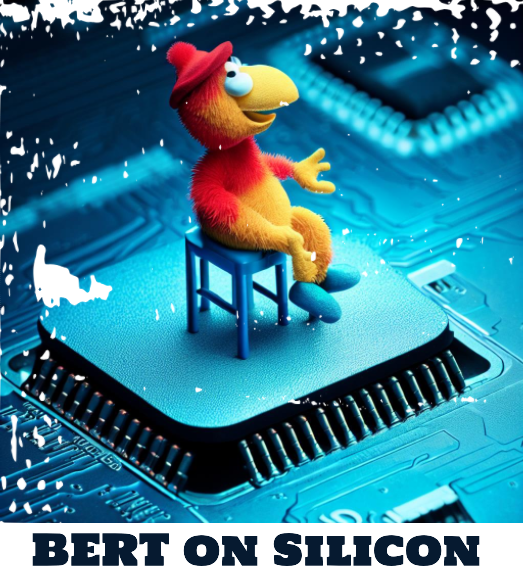

# BERT Model on Silicon
> **Research and Materials on Hardware implementation of BERT (Bidirectional Encoder Representations from Transformers) Model**

  

## BERT Model

### Description
BERT is a method of pre-training language representations, meaning that we train a general-purpose "language understanding" model on a large text corpus (like Wikipedia) and then use that model for downstream NLP tasks. BERT was created and published in 2018 by Jacob Devlin and his colleagues from Google. BERT is conceptually simple and empirically powerful. It obtains new state-of-the-art results on eleven natural language processing tasks, including pushing the GLUE score to 80.5% (7.7% point absolute improvement), MultiNLI accuracy to 86.7 (5.6% absolute improvement), SQuAD v1.1 question answering Test F1 to 93.2 (1.5% absolute improvement) and SQuAD v2.0 Test F1 to 83.1 (5.1% absolute improvement).

### Architecture

BERT is a Transformer-based model. The architecture of BERT is similar to the original Transformer model, except that BERT has two separate Transformer models: one for the left-to-right direction (the “encoder”) and one for the right-to-left direction (the “encoder”). The output of each model is the hidden state output by the final Transformer layer. The two models are pre-trained jointly on a large corpus of unlabeled text. The pre-training task is a simple and straightforward masked language modeling objective. The pre-trained BERT model can then be fine-tuned with just one additional output layer to create state-of-the-art models for a wide range of tasks, such as question answering and language inference, without substantial task-specific architecture modifications.

--- 

## Reference Papers

**1. Attention Is All You Need**

   

 
 

The dominant sequence transduction models are based on complex recurrent or convolutional neural networks that include an encoder and a decoder. The best performing models also connect the encoder and decoder through an attention mechanism. We propose a new simple network architecture, the Transformer, based solely on attention mechanisms, dispensing with recurrence and convolutions entirely. Experiments on two machine translation tasks show these models to be superior in quality while being more parallelizable and requiring significantly less time to train. Our model achieves 28.4 BLEU on the WMT 2014 Englishto-German translation task, improving over the existing best results, including ensembles, by over 2 BLEU. On the WMT 2014 English-to-French translation task, our model establishes a new single-model state-of-the-art BLEU score of 41.8 after training for 3.5 days on eight GPUs, a small fraction of the training costs of the best models from the literature. We show that the Transformer generalizes well to other tasks by applying it successfully to English constituency parsing both with large and limited training data.

#

**2. BERT: Pre-training of Deep Bidirectional Transformers for Language Understanding**

     

We introduce a new language representation model called BERT, which stands for
Bidirectional Encoder Representations from Transformers. Unlike recent language representation models (Peters et al., 2018a; Radford et al., 2018), BERT is designed to pretrain deep bidirectional representations from unlabeled text by jointly conditioning on both left and right context in all layers. As a result, the pre-trained BERT model can be finetuned with just one additional output layer to create state-of-the-art models for a wide range of tasks, such as question answering and language inference, without substantial taskspecific architecture modifications.
 
BERT is conceptually simple and empirically powerful. It obtains new state-of-the-art results on eleven natural language processing tasks, including pushing the GLUE score to 80.5% (7.7% point absolute improvement), MultiNLI accuracy to 86.7% (4.6% absolute
improvement), SQuAD v1.1 question answering Test F1 to 93.2 (1.5 point absolute improvement) and SQuAD v2.0 Test F1 to 83.1 (5.1 point absolute improvement).

---

## Important Papers

**Distilling the Knowledge in a Neural Network**

  

**Distilling Knowledge Learned in BERT for Text Generation**

  

**DistilBERT, a distilled version of BERT: smaller, faster, cheaper and lighter**

  

**TinyBERT: Distilling BERT for Natural Language Understanding**

  

**Distilling the Knowledge in a Neural Network**

  

**FastBERT: a Self-distilling BERT with Adaptive Inference Time**

  

**Distilling Task-Specific Knowledge from BERT into Simple Neural Networks**

  

**Patient Knowledge Distillation for BERT Model Compression**

  

**MobileBERT: a Compact Task-Agnostic BERT for Resource-Limited Devices**

  

**Improving Multi-Task Deep Neural Networks via Knowledge Distillation for Natural Language Understanding**

  

---

## BERT on Silicon

### 2018
**Algorithm-Hardware Co-Design of Single Shot Detector for Fast Object Detection on FPGAs**

---
### 2019
**An Evaluation of Transfer Learning for Classifying Sales Engagement Emails at Large Scale**

**Pre-trained bert-gru model for relation extraction**

**Q8BERT: Quantized 8Bit BERT**

**Structured pruning of a BERT-based question answering model**

**Structured pruning of large language models**

**Tinybert: Distilling bert for natural language understanding**

---
### 2020
**A Low-Cost Reconfigurable Nonlinear Core for Embedded DNN Applications**

**A^3: Accelerating Attention Mechanisms in Neural Networks with Approximation**

**Accelerating event detection with DGCNN and FPGAS**

**An Empirical Analysis of BERT Embedding for Automated Essay Scoring**

**An investigation on different underlying quantization schemes for pre-trained language models**

**ATT: A Fault-Tolerant ReRAM Accelerator for Attention-based Neural Networks**

**Binarybert: Pushing the limit of bert quantization**

**Capuchin: Tensor-based GPU Memory Management for Deep Learning**

**CATBERT: Context-Aware Tiny BERT for Detecting Social Engineering Emails**

**CatBERT: Context-Aware Tiny BERT for Detecting Targeted Social Engineering Emails**

**ColBERT: Efficient and Effective Passage Search via Contextualized Late Interaction over BERT**

**Combining Feature Selection Methods with BERT: An In-depth Experimental Study of Long Text Classification**

**Comparison of Deep Learning Models and Various Text Pre-Processing Techniques for the Toxic Comments Classification**

**Compressing BERT: Studying the Effects of Weight Pruning on Transfer Learning**

**Deep Learning Acceleration with Neuron-to-Memory Transformation**

**Efficient algorithms and hardware for natural language processing**

**Efficient transformer-based large scale language representations using hardware-friendly block structured pruning**

**FARM: A flexible accelerator for recurrent and memory augmented neural networks**

**Fastformers: Highly efficient transformer models for natural language understanding**

**FTRANS: energy-efficient acceleration of transformers using FPGA**

**Hardware accelerator for multi-head attention and position-wise feed-forward in the transformer**

**Improving Accuracy and Speeding Up Document Image Classification Through Parallel Systems**

**Improving post training neural quantization: Layer-wise calibration and integer programming**

**Integer quantization for deep learning inference: Principles and empirical evaluation**

**Look-Up Table based Energy Efficient Processing in Cache Support for Neural Network Acceleration**

**Poor Man's BERT: Smaller and Faster Transformer Models**

**PoWER-BERT: Accelerating BERT Inference via Progressive Word-vector Elimination**

**Pruning Redundant Mappings in Transformer Models via Spectral-Normalized Identity Prior**

**Q-BERT: Hessian Based Ultra Low Precision Quantization of BERT**

**ReTransformer: ReRAM-based processing-in-memory architecture for transformer acceleration**

**SqueezeBERT: What can computer vision teach NLP about efficient neural networks?**

**TernaryBERT: Distillation-aware Ultra-low Bit BERT**

**Training Large Neural Networks with Constant Memory using a New Execution Algorithm**

**Ultron-AutoML: An open-source, distributed, scalable framework for efficient hyper-parameter optimization**

**Towards Fully 8-bit Integer Inference for the Transformer Model**

**TopicBERT for energy efficient document classification**

---
### 2021
**A Framework for Area-efficient Multi-task BERT Execution on ReRAM-based Accelerators**

**A Full-Stack Search Technique for Domain Optimized Deep Learning Accelerators**

**A Microcontroller is All You Need: Enabling Transformer Execution on Low-Power IoT Endnodes**

**Accelerated Device Placement Optimization with Contrastive Learning**

**Accelerating bandwidth-bound deep learning inference with main-memory accelerators**

**Accelerating Emerging Neural Workloads**

**Accelerating Framework of Transformer by Hardware Design and Model Compression Co-Optimization**

**Accelerating Transformer-based Deep Learning Models on FPGAs using Column Balanced Block Pruning**

**Accommodating Transformer onto FPGA: Coupling the Balanced Model Compression and FPGA-Implementation Optimization**

**Adaptive Inference through Early-Exit Networks: Design, Challenges and Directions**

**Adaptive Spatio-Temporal Graph Enhanced Vision-Language Representation for Video QA**

**Algorithm-hardware Co-design of Attention Mechanism on FPGA Devices**

**Aquabolt-XL: Samsung HBM2-PIM with in-memory processing for ML accelerators and beyond**

**AUBER: Automated BERT regularization**

**Automatic Mixed-Precision Quantization Search of BERT**

**BERMo: What can BERT learn from ELMo?**

**BERT Model for Classification of Fake News using the Cloud Processing Capacity**

**Bertinho: Galician BERT representations**

**BERxiT: Early exiting for BERT with better fine-tuning and extension to regression**

**Beyond preserved accuracy: Evaluating loyalty and robustness of BERT compression**

**Binary Complex Neural Network Acceleration on FPGA : (Invited Paper)**

**Biomedical Named Entity Recognition at Scale**

**Block pruning for faster transformers**

**Compressing Large-Scale Transformer-Based Models: A Case Study on BERT**

**DAP-BERT: Differentiable Architecture Pruning of BERT**

**Demystifying BERT: Implications for Accelerator Design**

**Dynamic-TinyBERT: Boost TinyBERT's Inference Efficiency by Dynamic Sequence Length**

**EAGLE: Expedited Device Placement with Automatic Grouping for Large Models**

**EBERT: Efficient BERT Inference with Dynamic Structured Pruning**

**EdgeBERT: Sentence-Level Energy Optimizations for Latency-Aware Multi-Task NLP Inference**

**ELSA: Hardware-Software co-design for efficient, lightweight self-attention mechanism in neural networks**

**Enabling energy-efficient DNN training on hybrid GPU-FPGA accelerators**

**Energy efficiency boost in the AI-infused POWER10 processor**

**Fixed-point Quantization for Vision Transformer**

**FlexACC: A Programmable Accelerator with Application-Specific ISA for Flexible Deep Neural Network Inference**

**Gemmini: Enabling systematic deep-learning architecture evaluation via full-stack integration**

**Gobo: Quantizing attention-based nlp models for low latency and energy efficient inference**

**Hardware Acceleration of Fully Quantized BERT for Efficient Natural Language Processing**

**Hardware acceleration of sparse and irregular tensor computations of ml models: A survey and insights**

**HMC-TRAN: A Tensor-core Inspired Hierarchical Model Compression for Transformer-based DNNs on GPU**

**I-BERT: Integer-only BERT Quantization**

**Improving the efficiency of transformers for resource-constrained devices**

**KAISA: An adaptive second-order optimizer framework for deep neural networks**

**Kunlun: A 14nm High-Performance AI Processor for Diversified Workloads**

**Layerweaver: Maximizing Resource Utilization of Neural Processing Units via Layer-Wise Scheduling**

**M2M: Learning to Enhance Low-Light Image from Model to Mobile FPGA**

**NeuralScale: A RISC-V Based Neural Processor Boosting AI Inference in Clouds**

**NLP-Fast: A Fast, Scalable, and Flexible System to Accelerate Large-Scale Heterogeneous NLP Models**

**NPE: An FPGA-based Overlay Processor for Natural Language Processing**

**Predicting Efficiency/Effectiveness Trade-offs for Dense vs. Sparse Retrieval Strategy Selection**

**PTQ4ViT: Post-Training Quantization Framework for Vision Transformers with Twin Uniform Quantization**

**Randomly Wired Network Based on RoBERTa and Dialog History Attention for Response Selection**

**Re2PIM: A Reconfigurable ReRAM-Based PIM Design for Variable-Sized Vector-Matrix Multiplication**

**RISC-VTF: RISC-V Based Extended Instruction Set for Transformer**

**RMSMP: A Novel Deep Neural Network Quantization Framework with Row-wise Mixed Schemes and Multiple Precisions**

**Simplified TinyBERT: Knowledge Distillation for Document Retrieval**

**SmaQ: Smart Quantization for DNN Training by Exploiting Value Clustering**

**Softermax: Hardware/Software Co-Design of an Efficient Softmax for Transformers**

**SpAtten: Efficient Sparse Attention Architecture with Cascade Token and Head Pruning**

**SQuAT: Sharpness- and Quantization-Aware Training for BERT**

**Stochastic precision ensemble: self-knowledge distillation for quantized deep neural networks**

**Talos: A Weighted Speedup-Aware Device Placement of Deep Learning Models**

**TR-BERT: Dynamic Token Reduction for Accelerating BERT Inference**

**Training with Quantization Noise for Extreme Model Compression**

**Transformer Acceleration with Dynamic Sparse Attention**

**Understanding and Overcoming the Challenges of Efficient Transformer Quantization**

**Vis-TOP: Visual Transformer Overlay Processor**

**Elbert: Fast albert with confidence-window based early exit**

**Ghostbert: Generate more features with cheap operations for BERT**

**ProtTrans: Toward Understanding the Language of Life Through Self-Supervised Learning**

**Prune once for all: Sparse pre-trained language models**

**ROSITA: Refined BERT cOmpreSsion with InTegrAted techniques**

**VS-Quant: Per-vector Scaled Quantization for Accurate Low-Precision Neural Network Inference**

---
### 2022
**A 28nm 27.5TOPS/W Approximate-Computing-Based Transformer Processor with Asymptotic Sparsity Speculating and Out-of-Order Computing**

**A 40nm 5.6TOPS/W 239GOPS/mm2 Self-Attention Processor with Sign Random Projection-based Approximation**

**A Dual-Mode Similarity Search Accelerator based on Embedding Compression for Online Cross-Modal Image-Text Retrieval**

**A Fast and Flexible FPGA-based Accelerator for Natural Language Processing Neural Networks**

**A Framework for Accelerating Transformer-Based Language Model on ReRAM-Based Architecture**

**A length adaptive algorithm-hardware co-design of transformer on FPGA through sparse attention and dynamic pipelining**

**A Resource-Saving Energy-Efficient Reconfigurable Hardware Accelerator for BERT-based Deep Neural Network Language Models using FFT Multiplication**

**A Self-Attention Network for Deep JSCCM: The Design and FPGA Implementation**

**Accelerating attention mechanism on fpgas based on efficient reconfigurable systolic array**

**Accelerating attention through gradient-based learned runtime pruning**

**Accelerating NLP Tasks on FPGA with Compressed BERT and a Hardware-Oriented Early Exit Method**

**Accelerating Transformer Networks through Recomposing Softmax Layers**

**Achieving the Performance of All-Bank In-DRAM PIM With Standard Memory Interface: Memory-Computation Decoupling**

**Adaptable Butterfly Accelerator for Attention-based NNs via Hardware and Algorithm Co-design**

**AlphaTuning: Quantization-Aware Parameter-Efficient Adaptation of Large-Scale Pre-Trained Language Models**

**Alternative non-BERT model choices for the textual classification in low-resource languages and environments**

**An Algorithm-Hardware Co-Optimized Framework for Accelerating N:M Sparse Transformers**

**An Automatic and Efficient BERT Pruning for Edge AI Systems**

**An Efficient Hardware Accelerator for Sparse Transformer Neural Networks**

**An Energy-Efficient Transformer Processor Exploiting Dynamic Weak Relevances in Global Attention**

**An FPGA-Based Transformer Accelerator Using Output Block Stationary Dataflow for Object Recognition Applications**

**Analog-memory-based 14nm Hardware Accelerator for Dense Deep Neural Networks including Transformers**

**Answer Fast: Accelerating BERT on the Tensor Streaming Processor**

**ANT: Exploiting Adaptive Numerical Data Type for Low-bit Deep Neural Network Quantization**

**APT: The master-copy-free training method for quantised neural network on edge devices**

**Auto-ViT-Acc: An FPGA-Aware Automatic Acceleration Framework for Vision Transformer with Mixed-Scheme Quantization**

**Balance Multi-Head Attention based on Software and Hardware Co-design**

**BEBERT: Efficient and robust binary ensemble BERT**

**BERT model optimization methods for inference: a comparative study of five alternative BERT-model implementations**

**BERT on a Data Diet: Finding Important Examples by Gradient-Based Pruning**

**BERTPerf: Inference Latency Predictor for BERT on ARM big.LITTLE Multi-Core Processors**

**BiBERT: Accurate Fully Binarized BERT**

**Bigger&Faster: Two-stage Neural Architecture Search for Quantized Transformer Models**

**BiT: Robustly Binarized Multi-distilled Transformer**

**Boosting Distributed Training Performance of the Unpadded BERT Model**

**Compact Token Representations with Contextual Quantization for Efficient Document Re-ranking**

**Compressing Pre-trained Transformers via Low-Bit NxM Sparsity for Natural Language Understanding**

**Compression of Generative Pre-trained Language Models via Quantization**

**CPSAA: Accelerating Sparse Attention using Crossbar-based Processing-In-Memory Architecture**

**Demystifying BERT: System Design Implications**

**DFX: A Low-latency Multi-FPGA Appliance for Accelerating Transformer-based Text Generation**

**DiVIT: Algorithm and architecture co-design of differential attention in vision transformer**

**DOTA: Detect and Omit Weak Attentions for Scalable Transformer Acceleration**

**DQ-BART: Efficient Sequence-to-Sequence Model via Joint Distillation and Quantization**

**DTQAtten: Leveraging Dynamic Token-based Quantization for Efficient Attention Architecture**

**Dynamic Precision Analog Computing for Neural Networks**

**EFA-Trans: An Efficient and Flexible Acceleration Architecture for Transformers**

**Elastic Processing and Hardware Architectures for Machine Learning**

**Enabling and Accelerating Dynamic Vision Transformer Inference for Real-Time Applications**

**Enabling Efficient Large-Scale Deep Learning Training with Cache Coherent Disaggregated Memory Systems**

**Enabling Energy-Efficient Inference for Self-Attention Mechanisms in Neural Networks**

**Enabling fast uncertainty estimation: accelerating bayesian transformers via algorithmic and hardware optimizations**

**Enabling Fast Uncertainty Estimation: Exploiting Structured Sparsity in Bayesian Transformers**

**Ensemble Model Compression for Fast and Energy-Efficient Ranking on FPGAs**

**Extending the ONNX Runtime Framework for the Processing-in-Memory Execution**

**Fast Heterogeneous Task Mapping for Reducing Edge DNN Latency**

**FILM-QNN: Efficient FPGA Acceleration of Deep Neural Networks with Intra-Layer, Mixed-Precision Quantization**

**FPGA-aware automatic acceleration framework for vision transformer with mixed-scheme quantization: late breaking results**

**FPGA-based design and implementation of the location attention mechanism in neural networks**

**Future Scaling of Memory Hierarchy for Tensor Cores and Eliminating Redundant Shared Memory Traffic Using Inter-Warp Multicastin**

**Greedy-layer pruning: Speeding up transformer models for natural language processing**

**GuardNN: secure accelerator architecture for privacy-preserving deep learning**

**Handling heavy-tailed input of transformer inference on GPUs**

**Hardware Acceleration of Transformer Networks using FPGAs**

**Hardware and Software Co-design for Soft Switch in ViT Variants Processing Unit**

**Hardware and Software Co-optimization for Windows Attention**

**Improving Oversubscribed GPU Memory Performance in the PyTorch Framework**

**LLM.int8(): 8-bit Matrix Multiplication for Transformers at Scale**

**Low-Precision Quantization Techniques for Hardware-Implementation-Friendly BERT Models**

**MKQ-BERT: Quantized BERT with 4-bits Weights and Activations**

**Mokey: enabling narrow fixed-point inference for out-of-the-box floating-point transformer models**

**Near-Optimal Sparse Allreduce for Distributed Deep Learning**

**Optimal Brain Compression: A framework for accurate post-training quantization and pruning**

**PipeBERT: High-throughput BERT Inference for ARM Big.LITTLE Multi-core Processors**

**Post-Training Quantization for Longformer with Chunkwise Quantization Granularity and Optimized Percentile**

**Pre-trained Language Model with Feature Reduction and No Fine-Tuning**

**Privacy-Preserving Text Classification on BERT Embeddings with Homomorphic Encryption**

**ProSE: the architecture and design of a protein discovery engine**

**QDrop: Randomly Dropping Quantization for Extremely Low-bit Post-Training Quantization**

**QuaLA-MiniLM: a Quantized Length Adaptive MiniLM**

**RCT: Resource Constrained Training for Edge AI**

**ReAAP: A Reconfigurable and Algorithm-Oriented Array Processor With Compiler-Architecture Co-Design**

**Row-wise Accelerator for Vision Transformer**

**S4: a High-sparsity, High-performance AI Accelerator**

**SALO: an efficient spatial accelerator enabling hybrid sparse attention mechanisms for long sequences**

**Searching for memory-lighter architectures for OCR-augmented image captioning**

**SensiMix: Sensitivity-Aware 8-bit index & 1-bit value mixed precision quantization for BERT compression**

**Sentiment Analysis Using Pre-Trained Language Model With No Fine-Tuning and Less Resource**

**Software and Hardware Fusion Multi-Head Attention**

**Sparse Attention Acceleration with Synergistic In-Memory Pruning and On-Chip Recomputation**

**SwiftPruner: Reinforced Evolutionary Pruning for Efficient Ad Relevance**

**T-OPU: An FPGA-based Overlay Processor for Natural Language Processing**

**The Optimal BERT Surgeon: Scalable and Accurate Second-Order Pruning for Large Language Models**

**Towards efficient post-training quantization of pre-trained language models**

**Train Flat, Then Compress: Sharpness-Aware Minimization Learns More Compressible Models**

**TranCIM: Full-Digital Bitline-Transpose CIM-based Sparse Transformer Accelerator With Pipeline/Parallel Reconfigurable Modes**

**TransPIM: A Memory-based Acceleration via Software-Hardware Co-Design for Transformer**

**VAQF: Fully Automatic Software-Hardware Co-Design Framework for Low-Bit Vision Transformer**

**Varuna: Scalable, Low-cost Training of Massive Deep Learning Models**

**ViA: A Novel Vision-Transformer Accelerator Based on FPGA**

**XTC: Extreme Compression for Pre-trained Transformers Made Simple and Efficient**

**ZeroQuant: Efficient and Affordable Post-Training Quantization for Large-Scale Transformers**

**Fully Unsupervised Machine Translation Using Context-Aware Word Translation and Denoising Autoencoder**

**Hardware-friendly compression and hardware acceleration for transformer: A survey**

**Hardware/Software Co-Design of Edge DNN Accelerators with TFLite**

---
### 2023
**An Efficient Transformer Inference Engine on DSP**

**CHARM: Composing Heterogeneous Accelerators for Matrix Multiply on Versal ACAP Architecture**

**DTATrans: Leveraging Dynamic Token-Based Quantization With Accuracy Compensation Mechanism for Efficient Transformer Architecture**

**HAMMER: Hardware-friendly Approximate Computing for Self-attention with Mean-redistribution and Linearization**

**ViTA: A Vision Transformer Inference Accelerator for Edge Applications**

**TRON: Transformer Neural Network Acceleration with Non-Coherent Silicon Photonics**

**SmoothQuant: Accurate and Efficient Post-Training Quantization for Large Language Models**

**Sparse*BERT: Sparse Models Generalize To New tasks and Domains**

**Teacher Intervention: Improving Convergence of Quantization Aware Training for Ultra-Low Precision Transformers**

**TiC-SAT: Tightly-Coupled Systolic Accelerator for Transformers**

**ViTALiTy: Unifying Low-rank and Sparse Approximation for Vision Transformer Acceleration with a Linear Taylor Attention**

**Trends in AI inference energy consumption: Beyond the performance-vs-parameter laws of deep learning**

**TransCODE: Co-design of Transformers and Accelerators for Efficient Training and Inference**

**Architecting High Performance Silicon Systems for Accurate and Efficient On-Chip Deep Learning**

---
