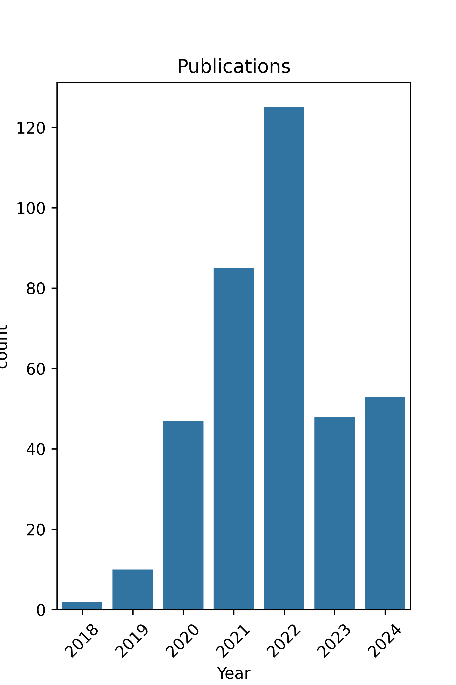

# Transformer Models Silicon Research

> **Research and Materials on Hardware implementation of Transformer Models**

<!-- 

  

  

 -->

## How to Contribute

**You can add new papers via pull requests, Please check `data/papers.yaml` and if your paper is not in list, add entity at the last item and create pull request.**

## Transformer and BERT Model

* BERT is a method of **pre-training language representations**, meaning that we **train a general-purpose *language understanding model*** on a large text corpus (like Wikipedia) and then use that model for downstream NLP tasks.

* BERT was created and **published in 2018 by Jacob Devlin and his colleagues from Google**. BERT is conceptually simple and empirically powerful. It obtains new state-of-the-art results on eleven natural language processing tasks.

  

* **BERT is a Transformer-based model.**
    * The architecture of BERT is similar to the original Transformer model, except that BERT has two separate Transformer models: one for the left-to-right direction (the “encoder”) and one for the right-to-left direction (the “encoder”).
    * The output of each model is the hidden state output by the final Transformer layer. The two models are pre-trained jointly on a large corpus of unlabeled text. The pre-training task is a simple and straightforward masked language modeling objective.
    * The pre-trained BERT model can then be fine-tuned with just one additional output layer to create state-of-the-art models for a wide range of tasks, such as question answering and language inference, without substantial task-specific architecture modifications.

---
### Reference Papers

**1. Attention Is All You Need**

  

 

The dominant sequence transduction models are based on complex recurrent or convolutional neural networks that include an encoder and a decoder. The best performing models also connect the encoder and decoder through an attention mechanism. We propose a new simple network architecture, the Transformer, based solely on attention mechanisms, dispensing with recurrence and convolutions entirely. Experiments on two machine translation tasks show these models to be superior in quality while being more parallelizable and requiring significantly less time to train. Our model achieves 28.4 BLEU on the WMT 2014 Englishto-German translation task, improving over the existing best results, including ensembles, by over 2 BLEU. On the WMT 2014 English-to-French translation task, our model establishes a new single-model state-of-the-art BLEU score of 41.8 after training for 3.5 days on eight GPUs, a small fraction of the training costs of the best models from the literature. We show that the Transformer generalizes well to other tasks by applying it successfully to English constituency parsing both with large and limited training data.

**2. BERT: Pre-training of Deep Bidirectional Transformers for Language Understanding**

    

We introduce a new language representation model called BERT, which stands for
Bidirectional Encoder Representations from Transformers. Unlike recent language representation models (Peters et al., 2018a; Radford et al., 2018), BERT is designed to pretrain deep bidirectional representations from unlabeled text by jointly conditioning on both left and right context in all layers. As a result, the pre-trained BERT model can be finetuned with just one additional output layer to create state-of-the-art models for a wide range of tasks, such as question answering and language inference, without substantial taskspecific architecture modifications.
 
BERT is conceptually simple and empirically powerful. It obtains new state-of-the-art results on eleven natural language processing tasks, including pushing the GLUE score to 80.5% (7.7% point absolute improvement), MultiNLI accuracy to 86.7% (4.6% absolute
improvement), SQuAD v1.1 question answering Test F1 to 93.2 (1.5 point absolute improvement) and SQuAD v2.0 Test F1 to 83.1 (5.1 point absolute improvement).

---

# Hardware Research

### 2018
**Algorithm-Hardware Co-Design of Single Shot Detector for Fast Object Detection on FPGAs**

**SparseNN: An energy-efficient neural network accelerator exploiting input and output sparsity**

---
### 2019
**A Power Efficient Neural Network Implementation on Heterogeneous FPGA and GPU Devices**

**A Simple and Effective Approach to Automatic Post-Editing with Transfer Learning**

**An Evaluation of Transfer Learning for Classifying Sales Engagement Emails at Large Scale**

**MAGNet: A Modular Accelerator Generator for Neural Networks**

**mRNA: Enabling Efficient Mapping Space Exploration for a Reconfiguration Neural Accelerator**

**Pre-trained bert-gru model for relation extraction**

**Q8BERT: Quantized 8Bit BERT**

**Structured pruning of a BERT-based question answering model**

**Structured pruning of large language models**

**Tinybert: Distilling bert for natural language understanding**

---
### 2020
**A Low-Cost Reconfigurable Nonlinear Core for Embedded DNN Applications**

**A Multi-Neural Network Acceleration Architecture**

**A Primer in BERTology: What We Know About How BERT Works**

**A Reconfigurable DNN Training Accelerator on FPGA**

**A^3: Accelerating Attention Mechanisms in Neural Networks with Approximation**

**Emerging Neural Workloads and Their Impact on Hardware**

**Accelerating event detection with DGCNN and FPGAS**

**An Empirical Analysis of BERT Embedding for Automated Essay Scoring**

**An investigation on different underlying quantization schemes for pre-trained language models**

**ATT: A Fault-Tolerant ReRAM Accelerator for Attention-based Neural Networks**

**Binarybert: Pushing the limit of bert quantization**

**Capuchin: Tensor-based GPU Memory Management for Deep Learning**

**CATBERT: Context-Aware Tiny BERT for Detecting Social Engineering Emails**

**CatBERT: Context-Aware Tiny BERT for Detecting Targeted Social Engineering Emails**

**ColBERT: Efficient and Effective Passage Search via Contextualized Late Interaction over BERT**

**Combining Feature Selection Methods with BERT: An In-depth Experimental Study of Long Text Classification**

**Comparison of Deep Learning Models and Various Text Pre-Processing Techniques for the Toxic Comments Classification**

**Compressing BERT: Studying the Effects of Weight Pruning on Transfer Learning**

**Compression of deep learning models for NLP**

**Deep Learning Acceleration with Neuron-to-Memory Transformation**

**Earlybert: Efficient bert training via early-bird lottery tickets**

**Efficient algorithms and hardware for natural language processing**

**Efficient transformer-based large scale language representations using hardware-friendly block structured pruning**

**FARM: A flexible accelerator for recurrent and memory augmented neural networks**

**Fastformers: Highly efficient transformer models for natural language understanding**

**FTRANS: energy-efficient acceleration of transformers using FPGA**

**Hardware accelerator for multi-head attention and position-wise feed-forward in the transformer**

**Improving Accuracy and Speeding Up Document Image Classification Through Parallel Systems**

**Improving post training neural quantization: Layer-wise calibration and integer programming**

**Integer quantization for deep learning inference: Principles and empirical evaluation**

**Ladabert: Lightweight adaptation of bert through hybrid model compression**

**Load What You Need: Smaller Versions of Multilingual BERT**

**Look-Up Table based Energy Efficient Processing in Cache Support for Neural Network Acceleration**

**MiniLM: Deep Self-Attention Distillation for Task-Agnostic Compression of Pre-Trained Transformers**

**Movement Pruning: Adaptive Sparsity by Fine-Tuning**

**MSP: an FPGA-specific mixed-scheme, multi-precision deep neural network quantization framework**

**Poor Man's BERT: Smaller and Faster Transformer Models**

**PoWER-BERT: Accelerating BERT Inference via Progressive Word-vector Elimination**

**Pruning Redundant Mappings in Transformer Models via Spectral-Normalized Identity Prior**

**Q-BERT: Hessian Based Ultra Low Precision Quantization of BERT**

**ReTransformer: ReRAM-based processing-in-memory architecture for transformer acceleration**

**SqueezeBERT: What can computer vision teach NLP about efficient neural networks?**

**TernaryBERT: Distillation-aware Ultra-low Bit BERT**

**Training Large Neural Networks with Constant Memory using a New Execution Algorithm**

**Ultron-AutoML: An open-source, distributed, scalable framework for efficient hyper-parameter optimization**

**Towards Fully 8-bit Integer Inference for the Transformer Model**

**TopicBERT for energy efficient document classification**

---
### 2021
**A Framework for Area-efficient Multi-task BERT Execution on ReRAM-based Accelerators**

**A Full-Stack Search Technique for Domain Optimized Deep Learning Accelerators**

**A Microcontroller is All You Need: Enabling Transformer Execution on Low-Power IoT Endnodes**

**A Quantitative Survey of Communication Optimizations in Distributed Deep Learning**

**A Study on Token Pruning for ColBERT**

**A White Paper on Neural Network Quantization**

**Accelerated Device Placement Optimization with Contrastive Learning**

**Accelerating bandwidth-bound deep learning inference with main-memory accelerators**

**Accelerating Emerging Neural Workloads**

**Accelerating Framework of Transformer by Hardware Design and Model Compression Co-Optimization**

**Accelerating Transformer-based Deep Learning Models on FPGAs using Column Balanced Block Pruning**

**Accommodating Transformer onto FPGA: Coupling the Balanced Model Compression and FPGA-Implementation Optimization**

**Adapting by pruning: A case study on BERT**

**Adaptive Inference through Early-Exit Networks: Design, Challenges and Directions**

**Adaptive Spatio-Temporal Graph Enhanced Vision-Language Representation for Video QA**

**Algorithm-hardware Co-design of Attention Mechanism on FPGA Devices**

**Aquabolt-XL: Samsung HBM2-PIM with in-memory processing for ML accelerators and beyond**

**AUBER: Automated BERT regularization**

**Automatic Mixed-Precision Quantization Search of BERT**

**BERMo: What can BERT learn from ELMo?**

**BERT Model for Classification of Fake News using the Cloud Processing Capacity**

**Bertinho: Galician BERT representations**

**BERxiT: Early exiting for BERT with better fine-tuning and extension to regression**

**Beyond preserved accuracy: Evaluating loyalty and robustness of BERT compression**

**Binary Complex Neural Network Acceleration on FPGA : (Invited Paper)**

**Biomedical Named Entity Recognition at Scale**

**Block pruning for faster transformers**

**Compressing Large-Scale Transformer-Based Models: A Case Study on BERT**

**DAP-BERT: Differentiable Architecture Pruning of BERT**

**Demystifying BERT: Implications for Accelerator Design**

**Dynamic-TinyBERT: Boost TinyBERT's Inference Efficiency by Dynamic Sequence Length**

**EAGLE: Expedited Device Placement with Automatic Grouping for Large Models**

**EBERT: Efficient BERT Inference with Dynamic Structured Pruning**

**EdgeBERT: Sentence-Level Energy Optimizations for Latency-Aware Multi-Task NLP Inference**

**ELSA: Hardware-Software co-design for efficient, lightweight self-attention mechanism in neural networks**

**Enabling energy-efficient DNN training on hybrid GPU-FPGA accelerators**

**Enabling One-Size-Fits-All Compilation Optimization for Inference Across Machine Learning Computers**

**Energy efficiency boost in the AI-infused POWER10 processor**

**Fixed-point Quantization for Vision Transformer**

**FlexACC: A Programmable Accelerator with Application-Specific ISA for Flexible Deep Neural Network Inference**

**Gemmini: Enabling systematic deep-learning architecture evaluation via full-stack integration**

**Gobo: Quantizing attention-based nlp models for low latency and energy efficient inference**

**Hardware Acceleration of Fully Quantized BERT for Efficient Natural Language Processing**

**Hardware acceleration of sparse and irregular tensor computations of ml models: A survey and insights**

**HMC-TRAN: A Tensor-core Inspired Hierarchical Model Compression for Transformer-based DNNs on GPU**

**HoloFormer: Deep Compression of Pre-Trained Transforms via Unified Optimization of N: M Sparsity and Integer Quantization**

**How Deep Learning Model Architecture and Software Stack Impacts Training Performance in the Cloud**

**How to Train BERT with an Academic Budget**

**I-BERT: Integer-only BERT Quantization**

**Improving the efficiency of transformers for resource-constrained devices**

**KAISA: An adaptive second-order optimizer framework for deep neural networks**

**KDLSQ-BERT: A Quantized Bert Combining Knowledge Distillation with Learned Step Size Quantization**

**Kunlun: A 14nm High-Performance AI Processor for Diversified Workloads**

**Layerweaver: Maximizing Resource Utilization of Neural Processing Units via Layer-Wise Scheduling**

**Learning Light-Weight Translation Models from Deep Transformer**

**M2M: Learning to Enhance Low-Light Image from Model to Mobile FPGA**

**NAS-BERT: Task-Agnostic and Adaptive-Size BERT Compression with Neural Architecture Search**

**NeuralScale: A RISC-V Based Neural Processor Boosting AI Inference in Clouds**

**NLP-Fast: A Fast, Scalable, and Flexible System to Accelerate Large-Scale Heterogeneous NLP Models**

**NPE: An FPGA-based Overlay Processor for Natural Language Processing**

**Predicting Efficiency/Effectiveness Trade-offs for Dense vs. Sparse Retrieval Strategy Selection**

**PTQ4ViT: Post-Training Quantization Framework for Vision Transformers with Twin Uniform Quantization**

**Randomly Wired Network Based on RoBERTa and Dialog History Attention for Response Selection**

**Re2PIM: A Reconfigurable ReRAM-Based PIM Design for Variable-Sized Vector-Matrix Multiplication**

**RISC-VTF: RISC-V Based Extended Instruction Set for Transformer**

**RMSMP: A Novel Deep Neural Network Quantization Framework with Row-wise Mixed Schemes and Multiple Precisions**

**Sanger: A Co-Design Framework for Enabling Sparse Attention using Reconfigurable Architecture**

**Simplified TinyBERT: Knowledge Distillation for Document Retrieval**

**SmaQ: Smart Quantization for DNN Training by Exploiting Value Clustering**

**Softermax: Hardware/Software Co-Design of an Efficient Softmax for Transformers**

**SpAtten: Efficient Sparse Attention Architecture with Cascade Token and Head Pruning**

**SQuAT: Sharpness- and Quantization-Aware Training for BERT**

**Stochastic precision ensemble: self-knowledge distillation for quantized deep neural networks**

**Talos: A Weighted Speedup-Aware Device Placement of Deep Learning Models**

**TR-BERT: Dynamic Token Reduction for Accelerating BERT Inference**

**Training with Quantization Noise for Extreme Model Compression**

**Transformer Acceleration with Dynamic Sparse Attention**

**Understanding and Overcoming the Challenges of Efficient Transformer Quantization**

**Vis-TOP: Visual Transformer Overlay Processor**

**Elbert: Fast albert with confidence-window based early exit**

**Ghostbert: Generate more features with cheap operations for BERT**

**ProtTrans: Toward Understanding the Language of Life Through Self-Supervised Learning**

**Prune once for all: Sparse pre-trained language models**

**ROSITA: Refined BERT cOmpreSsion with InTegrAted techniques**

**VS-Quant: Per-vector Scaled Quantization for Accurate Low-Precision Neural Network Inference**

---
### 2022
**A 28nm 27.5TOPS/W Approximate-Computing-Based Transformer Processor with Asymptotic Sparsity Speculating and Out-of-Order Computing**

**A 40nm 5.6TOPS/W 239GOPS/mm2 Self-Attention Processor with Sign Random Projection-based Approximation**

**A Dual-Mode Similarity Search Accelerator based on Embedding Compression for Online Cross-Modal Image-Text Retrieval**

**A Fast and Flexible FPGA-based Accelerator for Natural Language Processing Neural Networks**

**A Fast Post-Training Pruning Framework for Transformers**

**A Framework for Accelerating Transformer-Based Language Model on ReRAM-Based Architecture**

**A length adaptive algorithm-hardware co-design of transformer on FPGA through sparse attention and dynamic pipelining**

**A Lite Romanian BERT: ALR-BERT**

**A Resource-Saving Energy-Efficient Reconfigurable Hardware Accelerator for BERT-based Deep Neural Network Language Models using FFT Multiplication**

**A Self-Attention Network for Deep JSCCM: The Design and FPGA Implementation**

**Accelerating attention mechanism on fpgas based on efficient reconfigurable systolic array**

**Accelerating attention through gradient-based learned runtime pruning**

**Accelerating NLP Tasks on FPGA with Compressed BERT and a Hardware-Oriented Early Exit Method**

**Accelerating Transformer Networks through Recomposing Softmax Layers**

**Achieving the Performance of All-Bank In-DRAM PIM With Standard Memory Interface: Memory-Computation Decoupling**

**Adaptable Butterfly Accelerator for Attention-based NNs via Hardware and Algorithm Co-design**

**AlphaTuning: Quantization-Aware Parameter-Efficient Adaptation of Large-Scale Pre-Trained Language Models**

**Alternative non-BERT model choices for the textual classification in low-resource languages and environments**

**An Algorithm-Hardware Co-Optimized Framework for Accelerating N:M Sparse Transformers**

**An Automatic and Efficient BERT Pruning for Edge AI Systems**

**An Efficient Hardware Accelerator for Sparse Transformer Neural Networks**

**An Energy-Efficient Transformer Processor Exploiting Dynamic Weak Relevances in Global Attention**

**An FPGA-Based Transformer Accelerator Using Output Block Stationary Dataflow for Object Recognition Applications**

**Analog-memory-based 14nm Hardware Accelerator for Dense Deep Neural Networks including Transformers**

**Answer Fast: Accelerating BERT on the Tensor Streaming Processor**

**ANT: Exploiting Adaptive Numerical Data Type for Low-bit Deep Neural Network Quantization**

**APT: The master-copy-free training method for quantised neural network on edge devices**

**Auto-ViT-Acc: An FPGA-Aware Automatic Acceleration Framework for Vision Transformer with Mixed-Scheme Quantization**

**Balance Multi-Head Attention based on Software and Hardware Co-design**

**BEBERT: Efficient and robust binary ensemble BERT**

**BERT model optimization methods for inference: a comparative study of five alternative BERT-model implementations**

**BERT on a Data Diet: Finding Important Examples by Gradient-Based Pruning**

**BERTPerf: Inference Latency Predictor for BERT on ARM big.LITTLE Multi-Core Processors**

**BiBERT: Accurate Fully Binarized BERT**

**Bigger&Faster: Two-stage Neural Architecture Search for Quantized Transformer Models**

**BiT: Robustly Binarized Multi-distilled Transformer**

**Boosting Distributed Training Performance of the Unpadded BERT Model**

**Compact Token Representations with Contextual Quantization for Efficient Document Re-ranking**

**Compressing Pre-trained Transformers via Low-Bit NxM Sparsity for Natural Language Understanding**

**Compression of Generative Pre-trained Language Models via Quantization**

**CONNA: Configurable Matrix Multiplication Engine for Neural Network Acceleration**

**CPSAA: Accelerating Sparse Attention using Crossbar-based Processing-In-Memory Architecture**

**Demystifying BERT: System Design Implications**

**DFX: A Low-latency Multi-FPGA Appliance for Accelerating Transformer-based Text Generation**

**DiVIT: Algorithm and architecture co-design of differential attention in vision transformer**

**DOTA: Detect and Omit Weak Attentions for Scalable Transformer Acceleration**

**DQ-BART: Efficient Sequence-to-Sequence Model via Joint Distillation and Quantization**

**DTQAtten: Leveraging Dynamic Token-based Quantization for Efficient Attention Architecture**

**Dynamic Precision Analog Computing for Neural Networks**

**EFA-Trans: An Efficient and Flexible Acceleration Architecture for Transformers**

**Efficient Document Retrieval by End-to-End Refining and Quantizing BERT Embedding with Contrastive Product Quantization**

**Elastic Processing and Hardware Architectures for Machine Learning**

**Empirical Evaluation of Post-Training Quantization Methods for Language Tasks**

**Enabling and Accelerating Dynamic Vision Transformer Inference for Real-Time Applications**

**Enabling Efficient Large-Scale Deep Learning Training with Cache Coherent Disaggregated Memory Systems**

**Enabling Energy-Efficient Inference for Self-Attention Mechanisms in Neural Networks**

**Enabling fast uncertainty estimation: accelerating bayesian transformers via algorithmic and hardware optimizations**

**Enabling Fast Uncertainty Estimation: Exploiting Structured Sparsity in Bayesian Transformers**

**Ensemble Model Compression for Fast and Energy-Efficient Ranking on FPGAs**

**Extending the ONNX Runtime Framework for the Processing-in-Memory Execution**

**Extreme Compression for Pre-trained Transformers Made Simple and Efficient**

**Fast Heterogeneous Task Mapping for Reducing Edge DNN Latency**

**FILM-QNN: Efficient FPGA Acceleration of Deep Neural Networks with Intra-Layer, Mixed-Precision Quantization**

**Fine-and Coarse-Granularity Hybrid Self-Attention for Efficient BERT**

**FPGA-aware automatic acceleration framework for vision transformer with mixed-scheme quantization: late breaking results**

**FPGA-based design and implementation of the location attention mechanism in neural networks**

**From dense to sparse: Contrastive pruning for better pre-trained language model compression**

**Future Scaling of Memory Hierarchy for Tensor Cores and Eliminating Redundant Shared Memory Traffic Using Inter-Warp Multicastin**

**Greedy-layer pruning: Speeding up transformer models for natural language processing**

**GuardNN: secure accelerator architecture for privacy-preserving deep learning**

**Handling heavy-tailed input of transformer inference on GPUs**

**Hardware Acceleration of Transformer Networks using FPGAs**

**Hardware and Software Co-design for Soft Switch in ViT Variants Processing Unit**

**Hardware and Software Co-optimization for Windows Attention**

**Improving Oversubscribed GPU Memory Performance in the PyTorch Framework**

**Integer Fine-tuning of Transformer-based Models**

**Learned Token Pruning in Contextualized Late Interaction over BERT (ColBERT)**

**Lightweight Composite Re-Ranking for Efficient Keyword Search with BERT**

**Lightweight Transformers for Conversational AI**

**LLM.int8(): 8-bit Matrix Multiplication for Transformers at Scale**

**Low-Bit Quantization of Transformer for Audio Speech Recognition**

**Low-Precision Quantization Techniques for Hardware-Implementation-Friendly BERT Models**

**MKQ-BERT: Quantized BERT with 4-bits Weights and Activations**

**Mokey: enabling narrow fixed-point inference for out-of-the-box floating-point transformer models**

**Mr. BiQ: Post-Training Non-Uniform Quantization Based on Minimizing the Reconstruction Error**

**Near-Optimal Sparse Allreduce for Distributed Deep Learning**

**Nebula: A Scalable and Flexible Accelerator for DNN Multi-Branch Blocks on Embedded Systems**

**NEEBS: Nonexpert large-scale environment building system for deep neural network**

**Optimal Brain Compression: A framework for accurate post-training quantization and pruning**

**PipeBERT: High-throughput BERT Inference for ARM Big.LITTLE Multi-core Processors**

**Post-Training Quantization for Longformer with Chunkwise Quantization Granularity and Optimized Percentile**

**Pre-trained Language Model with Feature Reduction and No Fine-Tuning**

**Privacy-Preserving Text Classification on BERT Embeddings with Homomorphic Encryption**

**ProSE: the architecture and design of a protein discovery engine**

**QDrop: Randomly Dropping Quantization for Extremely Low-bit Post-Training Quantization**

**QuaLA-MiniLM: a Quantized Length Adaptive MiniLM**

**RCT: Resource Constrained Training for Edge AI**

**ReAAP: A Reconfigurable and Algorithm-Oriented Array Processor With Compiler-Architecture Co-Design**

**Row-wise Accelerator for Vision Transformer**

**S4: a High-sparsity, High-performance AI Accelerator**

**SALO: an efficient spatial accelerator enabling hybrid sparse attention mechanisms for long sequences**

**Searching for memory-lighter architectures for OCR-augmented image captioning**

**SensiMix: Sensitivity-Aware 8-bit index & 1-bit value mixed precision quantization for BERT compression**

**Sentiment Analysis Using Pre-Trained Language Model With No Fine-Tuning and Less Resource**

**Software and Hardware Fusion Multi-Head Attention**

**Sparse Attention Acceleration with Synergistic In-Memory Pruning and On-Chip Recomputation**

**SwiftPruner: Reinforced Evolutionary Pruning for Efficient Ad Relevance**

**T-OPU: An FPGA-based Overlay Processor for Natural Language Processing**

**The Optimal BERT Surgeon: Scalable and Accurate Second-Order Pruning for Large Language Models**

**Towards efficient post-training quantization of pre-trained language models**

**Train Flat, Then Compress: Sharpness-Aware Minimization Learns More Compressible Models**

**TranCIM: Full-Digital Bitline-Transpose CIM-based Sparse Transformer Accelerator With Pipeline/Parallel Reconfigurable Modes**

**TransPIM: A Memory-based Acceleration via Software-Hardware Co-Design for Transformer**

**VAQF: Fully Automatic Software-Hardware Co-Design Framework for Low-Bit Vision Transformer**

**Varuna: Scalable, Low-cost Training of Massive Deep Learning Models**

**ViA: A Novel Vision-Transformer Accelerator Based on FPGA**

**Work-in-Progress: Utilizing latency and accuracy predictors for efficient hardware-aware NAS**

**XTC: Extreme Compression for Pre-trained Transformers Made Simple and Efficient**

**ZeroQuant: Efficient and Affordable Post-Training Quantization for Large-Scale Transformers**

**Fully Unsupervised Machine Translation Using Context-Aware Word Translation and Denoising Autoencoder**

**DistilHuBERT: Speech representation learning by layer-wise distillation of hidden-unit BERT**

**Data Movement Reduction for DNN Accelerators: Enabling Dynamic Quantization Through an eFPGA**

**Hardware-friendly compression and hardware acceleration for transformer: A survey**

**Hardware/Software Co-Design of Edge DNN Accelerators with TFLite**

**Workload-Balanced Graph Attention Network Accelerator with Top-K Aggregation Candidates**

---
### 2023
**An Efficient Transformer Inference Engine on DSP**

**CHARM: Composing Heterogeneous Accelerators for Matrix Multiply on Versal ACAP Architecture**

**DTATrans: Leveraging Dynamic Token-Based Quantization With Accuracy Compensation Mechanism for Efficient Transformer Architecture**

**ENEX-FP: A BERT-Based Address Recognition Model**

**HAMMER: Hardware-friendly Approximate Computing for Self-attention with Mean-redistribution and Linearization**

**SECDA-TFLite: A toolkit for efficient development of FPGA-based DNN accelerators for edge inference**

**SmoothQuant: Accurate and Efficient Post-Training Quantization for Large Language Models**

**Sparse*BERT: Sparse Models Generalize To New tasks and Domains**

**Teacher Intervention: Improving Convergence of Quantization Aware Training for Ultra-Low Precision Transformers**

**TiC-SAT: Tightly-Coupled Systolic Accelerator for Transformers**

**ViTALiTy: Unifying Low-rank and Sparse Approximation for Vision Transformer Acceleration with a Linear Taylor Attention**

**ViTA: A Vision Transformer Inference Accelerator for Edge Applications**

**Trends in AI inference energy consumption: Beyond the performance-vs-parameter laws of deep learning**

**TRON: Transformer Neural Network Acceleration with Non-Coherent Silicon Photonics**

**TransCODE: Co-design of Transformers and Accelerators for Efficient Training and Inference**

**TinyVers: A Tiny Versatile System-on-chip with State-Retentive eMRAM for ML Inference at the Extreme Edge**

**Architecting High Performance Silicon Systems for Accurate and Efficient On-Chip Deep Learning**

**Hardware-efficient Softmax Approximation for Self-Attention Networks**

**Fast Prototyping Next-Generation Accelerators for New ML Models using MASE: ML Accelerator System Exploration**

**Advances in Electromagnetics Empowered by Artificial Intelligence and Deep Learning**

**A Scalable GPT-2 Inference Hardware Architecture on FPGA**

**BL-PIM: Varying the Burst Length to Realize the All-Bank Performance and Minimize the Multi-Workload Interference for in-DRAM PIM**

**Integrated Transformers Inference Framework for Multiple Tenants on GPU**

**Embedded Deep Learning Accelerators: A Survey on Recent Advances**

**Collective Communication Enabled Transformer Acceleration on Heterogeneous Clusters**

**FET-OPU: A Flexible and Efficient FPGA-Based Overlay Processor for Transformer Networks**

**Racism and Hate Speech Detection on Twitter: A QAHA-Based Hybrid Deep Learning Approach Using LSTM-CNN**

**Enabling efficient edge intelligence: a hardware-software codesign approach**

**Automatic Kernel Generation for Large Language Models on Deep Learning Accelerators**

**A Low-Latency and Lightweight FPGA-Based Engine for Softmax and Layer Normalization Acceleration**

**PP-Transformer: Enable Efficient Deployment of Transformers Through Pattern Pruning**

**DEAP: Design Space Exploration for DNN Accelerator Parallelism**

**Understanding the Potential of FPGA-Based Spatial Acceleration for Large Language Model Inference**

**An RRAM-Based Computing-in-Memory Architecture and Its Application in Accelerating Transformer Inference**

**Mobile Transformer Accelerator Exploiting Various Line Sparsity and Tile-Based Dynamic Quantization**

**A Lightweight Transformer Model using Neural ODE for FPGAs**

**TPU v4: An Optically Reconfigurable Supercomputer for Machine Learning with Hardware Support for Embeddings**

**FlexGen: High-Throughput Generative Inference of Large Language Models with a Single GPU**

**ITA: An Energy-Efficient Attention and Softmax Accelerator for Quantized Transformers**

**X-Former: In-Memory Acceleration of Transformers**

**GPT4AIGChip: Towards Next-Generation AI Accelerator Design Automation via Large Language Models**

**HeatViT: Hardware-Efficient Adaptive Token Pruning for Vision Transformers**

**ViTCoD: Vision Transformer Acceleration via Dedicated Algorithm and Accelerator Co-Design**

**AccelTran: A Sparsity-Aware Accelerator for Dynamic Inference with Transformers**

**22.9 A 12nm 18.1TFLOPs/W Sparse Transformer Processor with Entropy-Based Early Exit, Mixed-Precision Predication and Fine-Grained Power Management**

**P^3 ViT: A CIM-Based High-Utilization Architecture With Dynamic Pruning and Two-Way Ping-Pong Macro for Vision Transformer**

**I-ViT: Integer-only Quantization for Efficient Vision Transformer Inference**

**Streaming Tensor Programs: A Programming Abstraction for Streaming Dataflow Accelerators**

---
### 2024
**A Cost-Efficient FPGA Implementation of Tiny Transformer Model using Neural ODE**

**FlightLLM: Efficient Large Language Model Inference with a Complete Mapping Flow on FPGAs**

**Accelerating Neural Networks for Large Language Models and Graph Processing with Silicon Photonics**

**Quantization and Hardware Architecture Co-Design for Matrix-Vector Multiplications of Large Language Models**

**RDCIM: RISC-V Supported Full-Digital Computing-in-Memory Processor With High Energy Efficiency and Low Area Overhead**

**A Survey on Hardware Accelerators for Large Language Models**

**BETA: Binarized Energy-Efficient Transformer Accelerator at the Edge**

**AttentionLego: An Open-Source Building Block For Spatially-Scalable Large Language Model Accelerator With Processing-In-Memory Technology**

**SSR: Spatial Sequential Hybrid Architecture for Latency Throughput Tradeoff in Transformer Acceleration**

**CIM-MLC: A Multi-level Compilation Stack for Computing-In-Memory Accelerators**

**CIM-MLC: A Multi-level Compilation Stack for Computing-In-Memory Accelerators**

**The Era of Generative Artificial Intelligence: In-Memory Computing Perspective**

**Hydragen: High-Throughput LLM Inference with Shared Prefixes**

**A Survey on Transformer Compression**

**SLEB: Streamlining LLMs through Redundancy Verification and Elimination of Transformer Blocks**

**Stochastic Spiking Attention: Accelerating Attention with Stochastic Computing in Spiking Networks**

**Reusing Softmax Hardware Unit for GELU Computation in Transformers**

**ConSmax: Hardware-Friendly Alternative Softmax with Learnable Parameters**

**Speculative Streaming: Fast LLM Inference without Auxiliary Models**

**H3D-Transformer: A Heterogeneous 3D (H3D) Computing Platform for Transformer Model Acceleration on Edge Devices**

**NeuPIMs: NPU-PIM Heterogeneous Acceleration for Batched LLM Inferencing**

**Cerberus: Triple Mode Acceleration of Sparse Matrix and Vector Multiplication**

**DEFA: Efficient Deformable Attention Acceleration via Pruning-Assisted Grid-Sampling and Multi-Scale Parallel Processing**

**FastDecode: High-Throughput GPU-Efficient LLM Serving using Heterogeneous Pipelines**

**Accelerating ViT Inference on FPGA through Static and Dynamic Pruning**

**Allspark: Workload Orchestration for Visual Transformers on Processing In-Memory Systems**

**Impact of High-Level-Synthesis on Reliability of Artificial Neural Network Hardware Accelerators**

**An FPGA-Based Reconfigurable Accelerator for Convolution-Transformer Hybrid EfficientViT**

**TransFRU: Efficient Deployment of Transformers on FPGA with Full Resource Utilization**

**PRIMATE: Processing in Memory Acceleration for Dynamic Token-pruning Transformers**

**SWAT: An Efficient Swin Transformer Accelerator Based on FPGA**

**VTR: An Optimized Vision Transformer for SAR ATR Acceleration on FPGA**

**Workload-Aware Hardware Accelerator Mining for Distributed Deep Learning Training**

**NeuPIMs: NPU-PIM Heterogeneous Acceleration for Batched LLM Inferencing**

**VITA: ViT Acceleration for Efficient 3D Human Mesh Recovery via Hardware-Algorithm Co-Design**

**HLSTransform: Energy-Efficient Llama 2 Inference on FPGAs Via High Level Synthesis**

**SCAR: Scheduling Multi-Model AI Workloads on Heterogeneous Multi-Chiplet Module Accelerators**

**Trio-ViT: Post-Training Quantization and Acceleration for Softmax-Free Efficient Vision Transformer**

**SambaNova SN40L: Scaling the AI Memory Wall with Dataflow and Composition of Experts**

**TensorMap: A Deep RL-Based Tensor Mapping Framework for Spatial Accelerators**

**JIT-Q: Just-in-time Quantization with Processing-In-Memory for Efficient ML Training**

**DCT-ViT: High-Frequency Pruned Vision Transformer with Discrete Cosine Transform**

**TransAxx: Efficient Transformers with Approximate Computing**

**ITA: An Energy-Efficient Attention and Softmax Accelerator for Quantized Transformers**

**QServe: W4A8KV4 Quantization and System Co-design for Efficient LLM Serving**

**BitShare: An Efficient Precision-Scalable Accelerator with Combining-Like-Terms GEMM**

**SDA: Low-Bit Stable Diffusion Acceleration on Edge FPGA**

**Hardware Accelerator for MobileViT Vision Transformer with Reconfigurable Computation**

**In-Memory Transformer Self-Attention Mechanism Using Passive Memristor Crossbar**

**A 3.55 mJ/frame Energy-efficient Mixed-Transformer based Semantic Segmentation Accelerator for Mobile Devices**

**FLAG: Formula-LLM-Based Auto-Generator for Baseband Hardware**

**LPU: A Latency-Optimized and Highly Scalable Processor for Large Language Model Inference**

**LPU: A Latency-Optimized and Highly Scalable Processor for Large Language Model Inference**

**ARTEMIS: A Mixed Analog-Stochastic In-DRAM Accelerator for Transformer Neural Networks**

**CHOSEN: Compilation to Hardware Optimization Stack for Efficient Vision Transformer Inference**

**Co-Designing Binarized Transformer and Hardware Accelerator for Efficient End-to-End Edge Deployment**

**SPSA: Exploring Sparse-Packing Computation on Systolic Arrays From Scratch**

**SPSA: Exploring Sparse-Packing Computation on Systolic Arrays From Scratch**

**MECLA: Memory-Compute-Efficient LLM Accelerator with Scaling Sub-matrix Partition**

**TCP: A Tensor Contraction Processor for AI Workloads Industrial Product**

**A 109-GOPs/W FPGA-based Vision Transformer Accelerator with Weight-Loop Dataflow Featuring Data Reusing and Resource Saving**

**Klotski v2: Improved DNN Model Orchestration Framework for Dataflow Architecture Accelerators**

**Quartet: A Holistic Hybrid Parallel Framework for Training Large Language Models**

**Inference with Transformer Encoders on ARM and RISC-V Multicore Processors**

**Mentor: A Memory-Eficient Sparse-dense Matrix Multiplication Accelerator Based on Column-Wise Product**

**Cost-Effective LLM Accelerator Using Processing in Memory Technology**

**A 28nm 4.35TOPS/mm2 Transformer Accelerator with Basis-vector Based Ultra Storage Compression, Decomposed Computation and Unified LUT-Assisted Cores**

**FPGA-Based Sparse Matrix Multiplication Accelerators: From State-of-the-art to Future Opportunities**

**CGRA4ML: A Framework to Implement Modern Neural Networks for Scientific Edge Computing**

---
## Analysis

  

